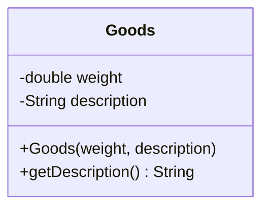
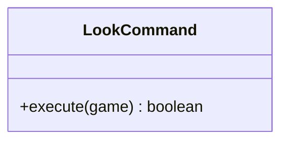

# wggg队伍项目实训报告

## 一、扩充功能一

### 1.扩充功能内容的具体描述：

扩展游戏，使得一个房间里可以存放任意数量的物件，每个物件可以有一个描述和一个重量值，玩家进入一个房间后，可以通过“look”命令查看当前房间的信息以及房间内的所有物品信息。

### 2.扩充功能的设计过程：

**a.**为了完成这个功能首先需要在项目中新建一个Goods类，此类保存物品信息，包括物品重量和物品描述。该类的结构如下图所示：

其中，weight是指房间中物品的重量、description是指对房间中物品的描述、Goods（weight, description）是用来构房间中造物品对象、getDescription()是用来获得房间中物品的描述。

**b.**此外，还要新增一个LookCommand类，此类是用于执行用户输入的Go命令的类，接收用户输入，查看房间内物品信息，因此该类需要继承Command类。该类的结构如下图所示：

其中，只需要重写父类Command的execute（）方法即可，。完成之后注意还要在CommandWords的构造方法中添加一个指令commands.put("look", new LookCommand())
，保证当用户输入look指令时能被系统识别调用对应的函数。

**c.**然后，还要在项目的Room类中添加两个方法，分别是getGoods()返回房间中的所有物品集合、setGoods(goods)为房间添加一些物品集合，以及为Room类添加一个goods变量代表每个房间中有哪些物品。

**d.**最后，在项目的Game类中创建一些物品，并把创建的物品添加到对应的房间之中，创建的物品：

water(3, "Water is used for drinking.")

platform(200, "A platform is a platform above the ground on which the speaker or lecturer stands to speak.")

wine(13, "Wine is a kind of alcoholic beverage fermented with starch or sugar in grains and fruits.")

equipment(100, "Equipment refers to the instruments and tools needed for experiments.")

desk(100, "Desk refers to the daily life, work and social activities for the convenience of work with the table.")

chair(50, "Chair refers to all kinds of chairs for convenience in daily work and social activities.")

为房间添加物品： theater：water、platform

pub：wine

lab：equipment

office：desk、chair

outside：null

### 3.完成情况说明：

扩充功能一已经完成

